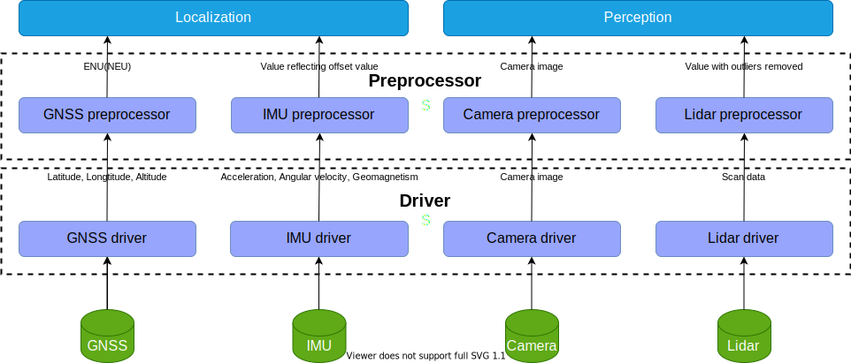

# Sensing design

## Abstract
Sensingでは、GMSS、IMU、Camera、Lidarからシリアル通信で取得した生データを整合・調整し、
それら結果をLocalization、Perceptionに渡す。

## 1.Requirements

- GNSSの緯度・経度情報から、ローカル座標系における相対座標値へ変換できること
- IMUの加速度・角速度の静的オフセット値を演算できること
- IMUの加速度・角速度の動的オフセット値を演算できること
- IMUの地磁気から静的オフセット値を演算できること
- Lidarの点群データから、データ範囲を選択できること
- Lidarの点群データから、外れ値を除去できること

詳細な要求仕様は[Sensing requirement](https://arcanain.github.io/arcanain-documentation/requirement/Sensing/)にまとめている。

## 2.Basic Design Architecture
Sensingにおける基本設計を下記に示す。

### Input
| Input | Topic Name | Data Type | Explanation |
| --- | --- | --- | --- | 
|  |  |  |  |
|  |  |  |  |
|  |  |  |  |

### Output
| Output | Topic Name | Data Type | Explanation |
| --- | --- | --- | --- | 
|  |  |  |  |
|  |  |  |  |
|  |  |  |  |

## 3.Detailed Design Architecture
Sensingにおける詳細設計を下記に示す。

### 3.1.GNSS Detailed Design
基本設計と要求仕様の仕様番号とのトレーサビリティが取れるような詳細設計アーキテクチャーを記載する。

#### Input
| Input | Topic Name | Data Type | Explanation |
| --- | --- | --- | --- | 
|  |  |  |  |
|  |  |  |  |
|  |  |  |  |

#### Output
| Output | Topic Name | Data Type | Explanation |
| --- | --- | --- | --- | 
|  |  |  |  |
|  |  |  |  |
|  |  |  |  |

### 3.2.IMU Detailed Design

#### Input
| Input | Topic Name | Data Type | Explanation |
| --- | --- | --- | --- | 
|  |  |  |  |
|  |  |  |  |
|  |  |  |  |

#### Output
| Output | Topic Name | Data Type | Explanation |
| --- | --- | --- | --- | 
|  |  |  |  |
|  |  |  |  |
|  |  |  |  |

### 3.3.Camera Detailed Design

#### Input
| Input | Topic Name | Data Type | Explanation |
| --- | --- | --- | --- | 
|  |  |  |  |
|  |  |  |  |
|  |  |  |  |

#### Output
| Output | Topic Name | Data Type | Explanation |
| --- | --- | --- | --- | 
|  |  |  |  |
|  |  |  |  |
|  |  |  |  |

### 3.4.Lidar Detailed Design

#### Input
| Input | Topic Name | Data Type | Explanation |
| --- | --- | --- | --- | 
|  |  |  |  |
|  |  |  |  |
|  |  |  |  |

#### Output
| Output | Topic Name | Data Type | Explanation |
| --- | --- | --- | --- | 
|  |  |  |  |
|  |  |  |  |
|  |  |  |  |