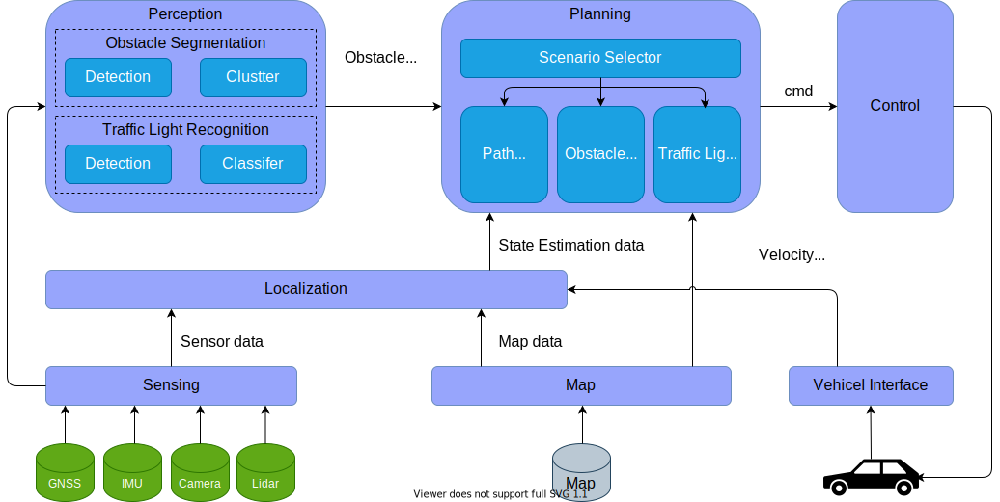

# Architecture overview
本ページでは、AASのアーキテクチャーの概念設計について説明する。

## 1.Requirements
概念設計は、以下の要件を満たすよう設計されている。

- 機能要素毎の不透明性を無くす
- 機能要素毎に独自性を持ち相互干渉を減らす
- 各機能のコンポーネントの独自開発が可能
- 機能拡張が容易な構成

## 2.High-level software architecture design

AASのソフトウェアアーキテクチャーは、以下の7つの機能から構成されている。各リンク先では機能毎の基本設計・詳細設計の内容を記載している。

| Module | Use cases |
| --- | --- | 
| [Sensing](Sensing) | 各センサ値を取得する |
| [Map](Map) | 走行環境の軌跡をLocalization部・Planning部に受け渡す |
| [Localization](Localization) | GNSSやIMUからローカル座標系での自己位置を推定する |
| [Perception](Perception) | Lidarやカメラ情報から障害物検知や信号機認識を行う |
| [Planning](Planning) | 走行環境・障害物情報・信号機情報から適切なシナリオを選択し、シナリオを遂行できる経路計画を行う |
| [Control](Control) | 経路計画から導き出される経路追従制御の結果を移動ロボットに対する指令値に変換し送信する |
| [Vehicle](Vehicle) | 指令値を受信し走行制御を行う。また、指令値の結果をもとに外部周知制御を行う |

## 3.High-level hardware architecture design

AASのハードウェアアーキテクチャーは、以下の4つの機能から構成されている。

| Module | Use cases |
| --- | --- | 
| Sensing | 各センサ値を取得する |
| Control | 指令値から速度制御を行う |
| External | 指令値の結果から外部周知のためのLEDやSpeaker制御を行う |
| Debug | モニタと接続しデバック作業を実施 |