# Development Process

本ページでは、Arcanainの開発工程についてまとめる。

## Development Model
Arcanainの開発モデルの概略図と対応ドキュメントリンクをまとめる。  

- [企画要求](https://arcanain.github.io/arcanain-documentation/architecture/) ：AASの企画要求について記載
- [要求定義](https://arcanain.github.io/arcanain-documentation/requirement/) ：AASの要求定義とフォーマットについて記載
- [基本設計](https://arcanain.github.io/arcanain-documentation/architecture/Sensing/) ：AASの基本設計図を記載
- [詳細設計](https://arcanain.github.io/arcanain-documentation/architecture/Sensing/) ：AASの詳細設計図とIFを記載
- [実装仕様](https://arcanain.github.io/arcanain-documentation/requirement/Sensing/) ：AASの実装仕様について記載

## Development Style
Development Modelの開発工程に従い、スクラム開発も取り入れたスタイルを採用している。

スケジュールやスプリング期間については協議中。  
今後、テスト駆動開発の取り入れも検討中。

